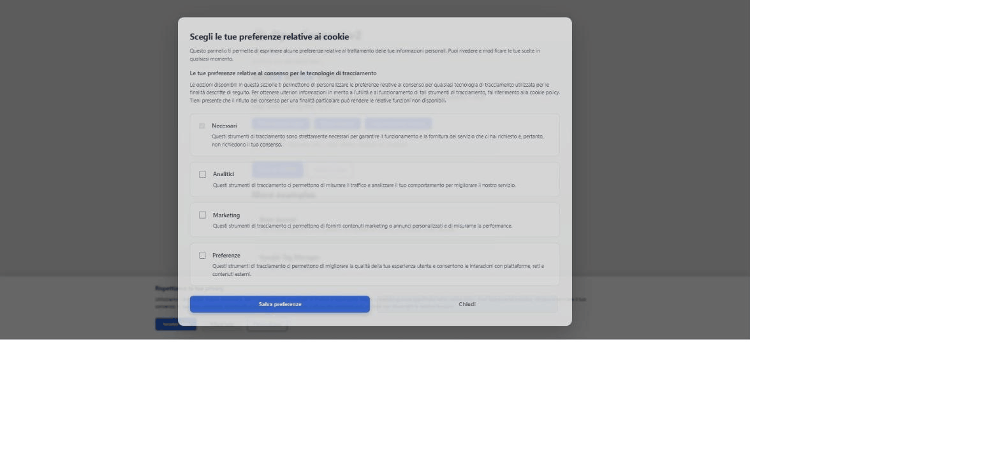

# OpenConsent

**Una piattaforma di gestione del consenso (CMP) GDPR leggera e senza dipendenze, con supporto nativo a Google Consent Mode v2.**

[](LICENSE)
[](https://www.npmjs.com/package/openconsent)
[-green.svg)]()
[]()
[]()
[]()

🇬🇧 [Read in English](README.md)

**[Prova la demo dal vivo →](https://ialias.github.io/OpenConsent/)**



L'alternativa gratuita e open source a Cookiebot, OneTrust e Iubenda: pieno controllo sulla
gestione del consenso, nessun vincolo al fornitore, nessun canone mensile. Un solo tag script,
zero dipendenze, **nessun backend richiesto**.

- 🔒 **GDPR prima di tutto** — nessun cookie prima del consenso, scadenza a 12 mesi, sanificazione di URL/CSS
- 🎯 **Google Consent Mode v2** — nativo, negato per default, zero configurazione
- 🎭 **Blocco degli script** — trattiene gli script di tracciamento finché l'utente non acconsente, sostituzione a caldo al cambio consenso
- 🧩 **Funziona ovunque** — tag `<script>`, npm (ESM + CommonJS), qualsiasi framework
- 🛡️ **Compatibile CSP** — supporto al nonce
- 🔄 **Pronto per le SPA** — MutationObserver per gli script aggiunti dinamicamente
- 🌍 **Multi-lingua** — italiano e inglese inclusi
- 📦 **Tipi TypeScript** — inclusi nel pacchetto

> Fa parte di una piccola **suite per la conformità web**: abbinalo ad
> [AccessiScan](https://github.com/iAlias/AccessiScan) per verificare l'accessibilità
> (WCAG 2.1 / EN 301 549) sugli stessi siti.

---

## Indice

- [Installazione](#installazione)
- [Avvio rapido](#avvio-rapido)
- [Come funziona il blocco degli script](#come-funziona-il-blocco-degli-script)
- [Configurazione](#configurazione)
- [Riferimento API](#riferimento-api)
- [Google Consent Mode v2](#google-consent-mode-v2)
- [Esempi per framework](#esempi-per-framework)
- [Migrazione dalla v1 (`rs-cmp`)](#migrazione-dalla-v1-rs-cmp)
- [Opzionale: backend di logging del consenso](#opzionale-backend-di-logging-del-consenso)
- [Sviluppo](#sviluppo)
- [Sicurezza e conformità](#sicurezza-e-conformità)
- [Licenza](#licenza)

---

## Installazione

### Opzione A — Tag script (nessuna build)

```html
<script src="https://cdn.jsdelivr.net/npm/openconsent@2/dist/openconsent.min.js"></script>
<!-- ancorato a un tag su GitHub invece che su npm: -->
<script src="https://cdn.jsdelivr.net/gh/iAlias/OpenConsent@v2.0.1/dist/openconsent.min.js"></script>
```

Questo basta per il banner a configurazione zero. Posizionalo come **primo script in `<head>`**,
subito dopo `<title>`, in modo che i tracker vengano bloccati prima di essere eseguiti.

### Opzione B — npm

```bash
npm install openconsent
```

```js
// ESM
import { createOpenConsent } from 'openconsent';

const cmp = createOpenConsent({
  config: {
    banner: {
      privacyPolicyUrl: 'https://tuosito.com/privacy-policy',
      cookiePolicyUrl: 'https://tuosito.com/cookie-policy'
    }
  }
});
```

```js
// CommonJS
const { createOpenConsent } = require('openconsent');
```

Nella build per browser il singleton è esposto come **`window.OpenConsent`**
(`window.RSCMP` resta come alias retrocompatibile).

---

## Avvio rapido

```html
<!DOCTYPE html>
<html lang="it">
<head>
  <meta charset="UTF-8">
  <title>Il tuo sito</title>

  <!-- 1. Carica OpenConsent (si auto-inizializza) -->
  <script src="https://cdn.jsdelivr.net/npm/openconsent@2/dist/openconsent.min.js"></script>
</head>
<body>
  <!-- 2. Gli script con categoria restano bloccati finché non arriva il consenso -->
  <script type="text/plain" data-category="analytics">
    // Google Analytics (gtag.js), Plausible, Matomo, ...
  </script>

  <script type="text/plain" data-category="marketing">
    // Meta Pixel, Google Ads, TikTok Pixel, ...
  </script>
</body>
</html>
```

Alla prima visita OpenConsent mostra il banner, blocca ogni script con `data-category` e collega
automaticamente Google Consent Mode v2. Quando l'utente sceglie, gli script delle categorie
concesse vengono sbloccati **senza ricaricare la pagina**.

---

## Come funziona il blocco degli script

Contrassegna qualsiasi script con `type="text/plain"` e un `data-category`:

| Categoria | Uso tipico |
| --- | --- |
| `necessary` | Funzionalità essenziali — sempre attivo |
| `analytics` | Analisi e misurazione delle prestazioni |
| `marketing` | Pubblicità e remarketing |
| `preferences` | Preferenze e impostazioni dell'utente |

```html
<!-- Bloccato finché "analytics" non viene concesso -->
<script type="text/plain" data-category="analytics">/* ... */</script>

<!-- Mai bloccato -->
<script data-category="necessary">/* ... */</script>
```

OpenConsent rileva e blocca automaticamente anche i tracker più comuni (Google Analytics/gtag,
Meta Pixel, TikTok, Hotjar, Mixpanel, Amplitude, Clarity, DoubleClick e altri), inclusi gli
script aggiunti in seguito dalle SPA. Gli attributi critici (`type="module"`, `nonce`,
`integrity`, `crossorigin`) vengono preservati quando uno script viene sbloccato.

---

## Configurazione

```js
window.OpenConsent.init({
  config: {
    policyVersion: '1.0',
    banner: {
      position: 'bottom',        // 'top' | 'bottom' | 'center'
      layout: 'bar',             // 'bar' | 'box' | 'modal'
      primaryColor: '#0084ff',
      backgroundColor: '#ffffff',
      textColor: '#000000',
      buttonTextColor: '#ffffff',
      showLogo: false,
      logoUrl: 'https://tuosito.com/logo.svg',
      privacyPolicyUrl: 'https://tuosito.com/privacy-policy',
      cookiePolicyUrl: 'https://tuosito.com/cookie-policy'
    },
    categories: [
      { id: 'necessary',   name: 'Necessari',    required: true,  enabled: true },
      { id: 'analytics',   name: 'Statistiche',  required: false, enabled: false },
      { id: 'marketing',   name: 'Marketing',    required: false, enabled: false },
      { id: 'preferences', name: 'Preferenze',   required: false, enabled: false }
    ],
    translations: {
      it: { title: 'Rispettiamo la tua privacy' /* ... */ },
      en: { title: 'We respect your privacy'    /* ... */ }
    }
  }
});
```

Puoi anche configurarlo interamente tramite il tag script:

```html
<script
  src="https://cdn.jsdelivr.net/npm/openconsent@2/dist/openconsent.min.js"
  data-site-id="YOUR_SITE_ID"
  data-api-url="https://tua-api.esempio.com"
  data-auto-init="true"></script>
```

`data-api-url` è **opzionale**. Senza di esso OpenConsent funziona interamente lato client e
non effettua mai richieste di rete.

---

## Riferimento API

Il singleton è disponibile come `window.OpenConsent` nel browser, oppure creato esplicitamente
con `createOpenConsent()` in un bundler.

| Metodo | Descrizione |
| --- | --- |
| `init(options?)` | Inizializza il CMP. Si risolve quando la configurazione è caricata. |
| `getConsent()` | Categorie di consenso correnti, o `null` se non ancora scelte. |
| `applyConsent(categories)` | Applica le categorie in modo programmatico (sblocca gli script, aggiorna il Consent Mode). |
| `showPreferences()` | Riapre il pannello delle preferenze. |
| `resetConsent()` | Cancella il consenso e mostra di nuovo il banner. |
| `getStatus()` | Istantanea diagnostica: `{ initialized, siteId, consent, blockedScripts, bannerVisible }`. |
| `enableDebug()` / `disableDebug()` / `setDebugMode(bool)` | Attiva/disattiva il logging dettagliato. |
| `testConsentMode()` | Stampa lo stato corrente di Google Consent Mode. |

### Eventi

```js
window.OpenConsent.consentManager.on('consentUpdated', (categories) => {
  console.log('Consenso cambiato:', categories);
});
```

### Categorie di consenso

```ts
interface ConsentCategories {
  necessary: boolean;
  analytics: boolean;
  marketing: boolean;
  preferences: boolean;
}
```

---

## Google Consent Mode v2

OpenConsent imposta uno stato **negato per default** il prima possibile e lo aggiorna quando
l'utente sceglie. Nessuna configurazione richiesta. Il comportamento predefinito nega
`ad_storage`, `ad_user_data`, `ad_personalization`, `analytics_storage`,
`functionality_storage` e `personalization_storage`, concedendo invece `security_storage`.

```html
<script async src="https://www.googletagmanager.com/gtag/js?id=G-XXXXXXXXXX"></script>
```

---

## Esempi per framework

<details>
<summary><strong>React / Next.js (solo client)</strong></summary>

```jsx
'use client';
import { useEffect } from 'react';

export default function ConsentLoader() {
  useEffect(() => {
    import('openconsent').then(({ createOpenConsent }) => {
      createOpenConsent();
    });
  }, []);

  return null;
}
```

Poi reagisci ai cambiamenti:

```js
window.OpenConsent.consentManager.on('consentUpdated', ({ analytics }) => {
  if (analytics) loadAnalytics();
});
```
</details>

<details>
<summary><strong>Google Tag Manager</strong></summary>

Vedi [`examples/gtm-implementation.html`](examples/gtm-implementation.html) per una guida
completa a GTM, incluso come attivare i tag al cambio del consenso e ispezionare lo stato del
Consent Mode.
</details>

<details>
<summary><strong>HTML semplice</strong></summary>

Prova la [demo dal vivo](https://ialias.github.io/OpenConsent/) oppure apri
[`examples/basic.html`](examples/basic.html) in locale — entrambe hanno pulsanti di prova e una
lettura dal vivo dello stato del consenso.
</details>

---

## Migrazione dalla v1 (`rs-cmp`)

La v2 rinomina il progetto in **OpenConsent** senza cambi che rompano gli embed esistenti:

- `window.RSCMP` continua a funzionare; `window.OpenConsent` è il nuovo nome.
- Il consenso salvato sotto `rs-cmp-consent` viene letto e **migrato automaticamente** a
  `openconsent` (localStorage) e il cookie viene rinominato in modo trasparente.
- Il vecchio percorso CDN `dist/cmp.min.js` continua a essere pubblicato per i tag script esistenti.
- La vecchia forma `init(config)` continua a funzionare; ora è supportata anche
  `init({ siteId, apiUrl, config })`.

---

## Opzionale: backend di logging del consenso

L'SDK **non richiede alcun backend**. Se vuoi memorizzare i record di consenso, la cartella
[`server-side/`](server-side/) contiene logger pronti da adattare:

- `node-logger.js` — esempio Node.js/Express + PostgreSQL
- `php-logger.php` — esempio PHP

Questi esempi hanno dipendenze proprie e **non** vengono installati con il pacchetto:

```bash
cd server-side && npm install
```

---

## Sviluppo

```bash
npm install     # installa le dipendenze di sviluppo
npm run build   # compila i bundle IIFE (dev + min), legacy, CommonJS ed ESM
npm test        # esegue la suite Jest
npm run lint    # ESLint
```

Struttura dei sorgenti:

| File | Scopo |
| --- | --- |
| `src/core.js` | La libreria: tutte le classi più `createOpenConsent()`, senza effetti collaterali |
| `src/browser.js` | Entry point per il browser: blocco degli script, `window.OpenConsent`, auto-init |
| `src/index.mjs` | Entry point ESM che ri-esporta il core |

I file `dist/openconsent.min.js` (e `dist/cmp.min.js`) versionati sono i bundle pubblicati; la
CI fallisce se si discostano dai sorgenti.

---

## Sicurezza e conformità

- Nessun cookie viene impostato prima del consenso.
- Il consenso è memorizzato in `localStorage`, con un cookie minimo di presenza di prima parte.
- URL e valori di colore CSS vengono sanificati prima di essere scritti nel DOM.
- Il logging backend opzionale applica hash SHA-256 agli indirizzi IP prima di salvarli.
- Il consenso scade dopo 12 mesi e viene richiesto di nuovo.

Vedi [`GDPR_COMPLIANCE.md`](GDPR_COMPLIANCE.md) per il dettaglio completo della conformità.

---

## Licenza

[MIT](LICENSE) © Antonino Di Stefano
